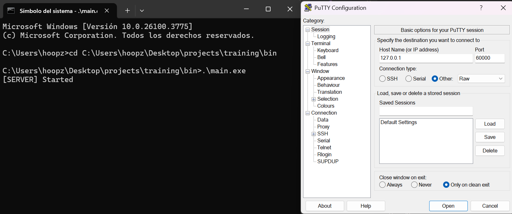

# 🧪 Test Case 2: Simulate Client Connection with PuTTY

**📅 Date:** 2025-04-19 
**🧰 Environment:**
- **OS:** Windows 11
- **Compiler:** g++ (MinGW, C++23)
- **Boost Version:** 1.82
- **Tool:** [PuTTY](https://www.putty.org/)
- **Server Run Command:** `.\bin\main.exe`

---

## 🔍 Objective  
Simulate a TCP client connection to the server using PuTTY and verify that the server accepts it and prints the client's IP address.

---

## 🧵 Steps  
1. Start the server:  
   ```bash
   .\bin\main.exe
   ```
2. Open PuTTY and configure a **Raw** or **Telnet** connection:
   - Hostname: `127.0.0.1`
   - Port: `60000`
   - Connection Type: **Raw**
3. Click **Open** to connect.

---

## ✅ Expected Result  
- Server prints the client IP address (e.g., `Connection from: 127.0.0.1`)
- PuTTY shows an open session (may be blank)

---

## 📸 Screenshot  
`test2_putty_connection.png`_  
```bash
docs/test2_putty_connection.png
```

Markdown:
```markdown

```

---

## 🧾 Server Log Output  
```
[INFO] Server started on port 60000
[INFO] Connection from: 127.0.0.1
```

---

## 🧠 Notes  
- No message exchange was performed — this only verifies the connection acceptance.
- PuTTY works great for raw TCP testing.
